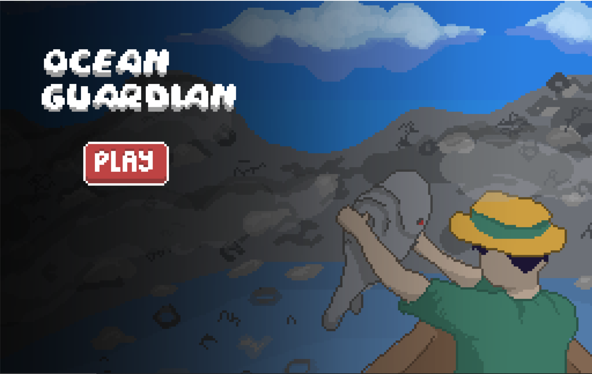
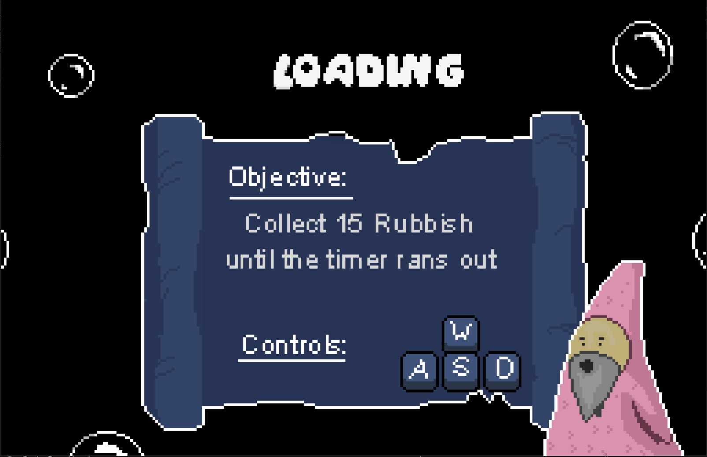
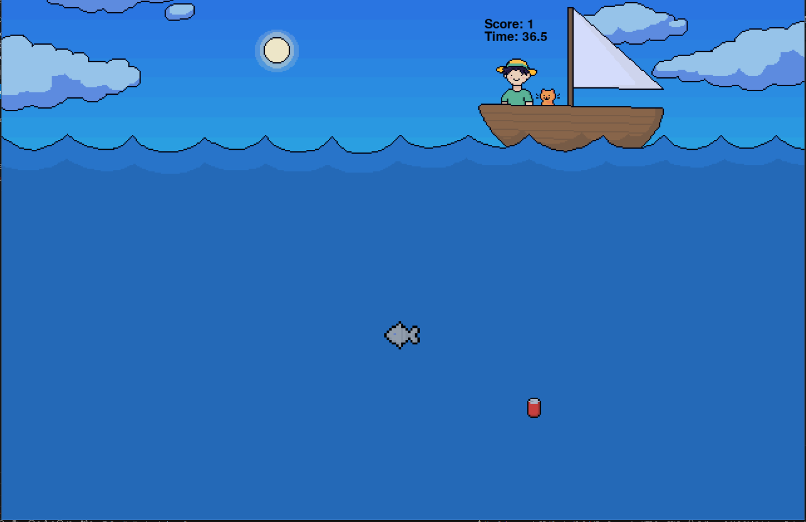

# OceanGuardian Game
## About

Ocean Guardian is a game where you invented a robot fish to prevent/reduce ocean pollution. This game aims to give awareness about the effects of ocean pollution in an interactive and enjoying way.

### Objectives:
The Objectives is to collect a specific number of rubbish *(Displayed in game)* in a specific time limit *(Displayed in game.)*

### Controls:
Use the **W A S D** Controls.
## Screenshots

## Requirements:
> **Python 3.2 or above**

>  **Required Libraries list:** 
>  *(Check out how to install the libraries in "Installation in windows step 2".)*
>  - pygame
>  - random
>  - sys
>  - Time

## Installation in windows

### Step 1: Clone this repository
**Method 1:** Using the git clone in the *cmd* or *powershell*
step 1: Navigate to the directory you want to put the repository using

    cd <directory>
   for example,
   

    cd desktop/myfolder

   

step 2: Clone using git clone command

    git clone https://github.com/frankiephs/OceanGuardianOfficial.git
   *if you do not have git, refer to method 2*

**Method 2:** Using the github Desktop
step 1: watch [this 3 minutes youtube tutorial about cloning a git repository using github desktop.](https://www.youtube.com/watch?v=PoZNIbs_wx8)

**Method 3:** Downloading the zip file
step 1: Click the 'Code' button
step 2: Click "Download ZIP"

### Step 2: Install the required libraries
**Method 1:** Manual download using *cmd* or *powershell*
step 1: Install using pip the package/library individually

    pip install <package name/library>
   Package/library names are listed above in the *"required libraries list"*
   for example,
   

    pip install pygame
   continue...
   

**Method 2:** Download all requirements using *cmd* or *powershell*
step 1: navigate to your directory using

    cd <directory>
   step 2: install requirements.txt
   

    pip install -r requirements.txt

### Step 3: Run the file
**Method 1**: Using *cmd** or **powershell*
step 1: use these commands

    python OceanGuardian.py
   or 
   

    python3 OceanGuardian.py
or 

    py OceanGuardian.py

**Method 2:** Manually executing it in your IDE
step 1: click the run button on your IDE
if you are using in vscode, click the **run** button or the **triangle** button that represents run.

## Installation in replit
**Step 1:** Click **create**
**Step 2:** Click **Import from github**
Step 3: Copy and paste the **github URL**

    https://github.com/frankiephs/OceanGuardianOfficial.git
Step 4: Select the *language* to **pygame**
Step 5: Click **Import from github**
Step 6: Click **run**
if you are getting no display, make sure to toggle **output** on the **tools stab** below the **files tab**.
 if it says `"no such file: main.py"`, change the file name of "OceanGuardian.py" to "main.py"
or use the shell to run the file with 

    python OceanGuardian.py
Any issues? Please refer to 'Frequently asked Question'.
 
## Game Tips:

> **Collect the rubbish as soon as it respawns because the rubbish**
> **respawns as soon as the previous rubbish disappears.**

## Frequently Asked Questions

### "Why can't I install requirements.txt or libraries using pip in cmd? Any solutions?"
> If using a school device, Installation or configuration of the device or hardware are prohibited. Use **Windows powershell** instead or use your **own personal computer**.
> Still cannot run? Use **replit** as an alternative.

### "Why is it not an exe file?"

> *.exe* files or *executables* are compiled files, Any changes will need to be compiled again to make it up to date. In this process, This reduces flexibility for the developers and for the users. 
>
### **"why not just create a configuration file?"**
> Configuration files are limited to variables and cannot change things such as functions, etc.
>
### **"Why not just use a portable python distribution and still be able to configure the files afterwards since it have its own directory for modules?"**
> A portable python distribution is still a large size approximately 700 MB (Depending on the version) This will not be very flexible for low end devices and 700 MB is too big for just a simple game.

### "Why not just publish it in gaming marketplaces?"
> We can publish it to gaming marketplaces like itch.io, etc. However, Just like the exe file, It is compiled, reduces flexibility and gaming marketplaces are not available in the school network. This requires an additional library called pygbag including asyncio. Pygbag games tend to be in low performance based on my experience.

### "Why not just embed it in web hosting platforms?"
> Web hosting platforms costs money, and again, flexibility.

### "Why not just self host it with your own server"
> Servers online costs money, flexibility, maintenance and additional hardwares.

### "Why is it 'not responding' in some areas even it is actually responding?"
> In the code, We use the "time.sleep(n)" method from the time library. This delays a particular code. When the software is pausing, Your PC thinks your PC is not responding so when you try to click the screen during those delays. The 'not responding' dialogue will pop up.

### "Why can't I press the 'x' or exit button?"
>In pygame, to exit the game, You will need to call the *'pygame.quit' and 'sys.exit'*, When in a delay method (refering to the previous question), the software stops or the file stops therefore it cannot call the quit method. "Then why on other areas are working?" Other areas use the tick difference to make a timer, this is quite complex and requires a longer code.  We are planning to remove the delay by proceeding with the "click to continue" system but that will consume another time.

### "It says pygame.mixer.init() error?"
> regarding to the `pygame.mixer.init()` error, This is because replit is a browser based IDE and the `pygame.mixer.init()` finds an audio device which is typically refering to the hardware. To solve this issue, you will need to **use the "pygame" language** instead of the "python" language. In this case, it now supports sounds from pygame.
> 
### "Why is the performance slower in replit?"
> Replit have its own GPU, RAM and storage because it is virtual environment that uses docker containers. These GPU, RAM, etc. have its own limitations and might require to upgrade your own account if you want a faster one. Pygame also runs fast frames therefore it requires a hardware that is fast too. **I will recommend installing the game in your device, please read "Installation on windows".**
### "Why are the sprite's appearance delayed in replit?"
> Please refer to 'Why is the performance slower in replit'  question. The display method and the timer are not on sync because of the performance issues. **I will recommend installing the game in your device, please read "Installation on windows".**

### "Why is the screen smaller in replit when I run it?"
> The game screen is fixed, therefore you cannot shrink the size proportions. You can maximize the output screen **by clicking the 3 dots and click maximize**. alternatively, you can change the size proportions but I won't recommend it because it will ruin the fixed pixel position of other elements.
## Credits:
- **Programmers and Debuggers**
	- Manling He
	- Frankie Bula
	- Chien Nguyen
- **Artworks Credits** 
	- Main Game background - designed by Manling He
	- Rubbish Sprites - designed by Manling He
	- Robot Fish Sprites - designed by Manling He
	- WinNews picture - designed by Frankie Bula, Picture from Pixabay.com
	- Breaking News Picture designed by Frankie Bula, Generated from breakyourownnews.com
	- Loading screen - designed by Frankie Bula
	- lose screen - designed by Frankie Bula
	- Start Screen/ Home screen - designed by Frankie Bula
	- WinScreen - Designed by Frankie Bula
- **Sound Credits**
	- OceanGuardian "Game On" - Composed by Frankie Bula
  	- OceanGuardian "TheOcean" - Composed by Frankie Bula
  	- success fanfare trumpets 6185- Pixabay
  	- comiendose-el-control-1-81452 / RoboFish Eating sound - Pixabay
  	- Shooting Sound FX - Pixabay
  	- wah-wah sound - Pixabay
	- Old Guy Naration: Objective, To move, We're doomed, Horay - Developed in Eleven Labs

## Still have an issue?
Please report the issue by creating an issue in the issue tab
